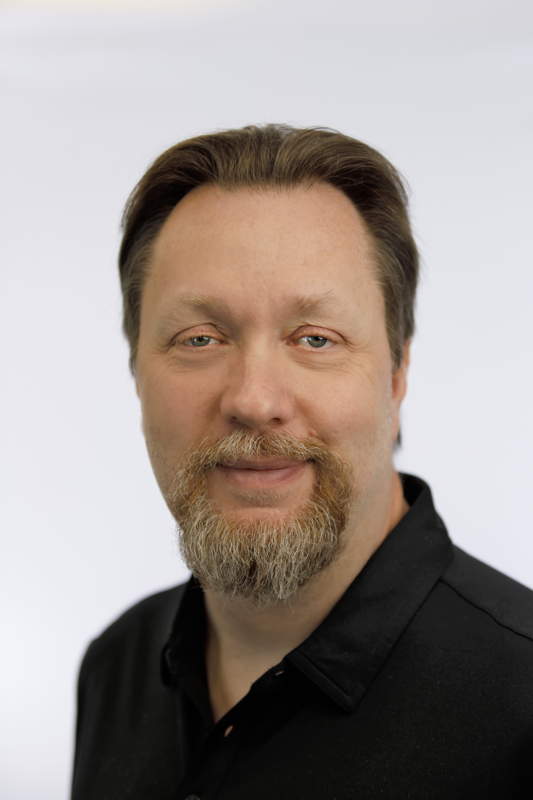

  
  

    <em style="font-size: 0.9em;">"Designing for today. Anticipating tomorrow."</em>
  

# About Me

---

I've spent my career architecting infrastructure that doesn't just connect systems but connects teams, priorities, and business outcomes. While I’ve worn many hats across networking, security, and cloud, what consistently drives me is solving complex problems in practical, scalable ways, especially when it means enabling others do their best work.

My path started in hands-on engineering, eventually earning my CCIE and leading enterprise-class network builds. But over time, I found I was just as passionate about how teams adopt technology as the technology itself. I’ve helped design data centers, multi-cloud environments, segmentation strategies, and automation frameworks. More importantly, I’ve helped engineers and leaders navigate change with clarity and confidence.

I specialize in networking, but I never approach problems in isolation. I work closely with adjacent teams to understand their needs, constraints, and objectives, because a successful architecture serves more than just the network. I'm always trying to solve for the bigger picture: aligning design decisions with business priorities, anticipating growth, and designing with future evolution in mind. Whether it’s understanding where quantum computing, quantum networking, or the Internet of Bodies may intersect with infrastructure, I aim to stay ahead, not just current.

I value clean, repeatable architectures. I believe vendor-neutral doesn't mean vendor-averse. I prefer asking the right questions over assuming the right answers. And I’m always thinking about how today’s decisions set the tone for what comes next.

I don’t believe in the idea of job security through gatekeeping. Architects and engineers should never make themselves indispensable by withholding knowledge.  We should make ourselves valuable by staying adaptable, sharing freely, and growing alongside the technologies we support.

When I’m not designing infrastructure, I’m often building internal communities, mentoring engineers, organizing working groups, or just encouraging quiet voices to speak up. Because great architecture isn’t built in isolation—it’s built with people.

Above all, I’m a lifelong learner. Staying at the forefront of technology requires curiosity, humility, and a willingness to evolve. That mindset has kept me moving forward and helping others do the same.
