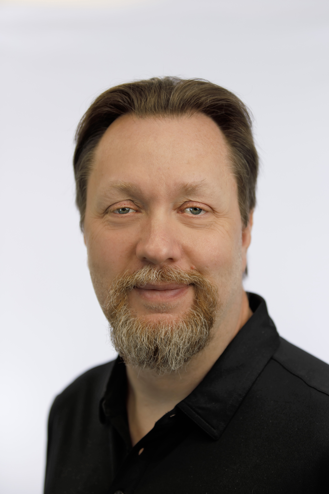

  
  

    <em style="font-size: 0.9em;">"Designing for today. Anticipating tomorrow."</em>
  

  
  

    <em style="font-size: 0.9em;">"Designing for today. Anticipating tomorrow."</em>
  

# About Me

## In Brief

I’m a Network and Cloud Networking Architect with over 15 years of architectural experience and an active CCIE held continuously for 24 years. My work centers on secure enterprise networking, data center architecture, hybrid and multi-cloud connectivity, segmentation, and automation-enabled network delivery.

I’m also expanding my architecture work toward AI-era infrastructure networking and governed automation, focusing on how enterprise AI changes requirements for connectivity, telemetry, observability, workload placement, data movement, and controlled AI-assisted operations.

At my best, I operate between strategy and implementation: translating emerging technology into practical architecture that can actually be built, supported, governed, and sustained.

---

## My Architecture Foundation

My career started in hands-on engineering and grew into enterprise-class network builds, data center architectures, hybrid and multi-cloud connectivity designs, segmentation strategies, and automation-enabled network delivery. Over time, my focus expanded beyond the technology itself into how teams adopt, operate, and sustain it.

I care about architecture that works in the real world: designs that are resilient, maintainable, understandable, and aligned to business and operational needs. My approach is deeply technical, but the goal is not technical complexity for its own sake. The goal is infrastructure that can actually be built, supported, explained, and evolved.

---

## How I Approach Architecture

I specialize in networking, but I never approach problems in isolation. A successful architecture serves more than the network. It has to account for security, cloud, operations, application needs, organizational constraints, and future growth.

That is why I work closely with adjacent teams to understand their priorities, constraints, and objectives before assuming the answer. The best technical design is not always the most complex or impressive one; it is the one that can be implemented, supported, explained, and evolved.

I value clean, repeatable architectures. I believe vendor-neutral does not mean vendor-averse, and best-of-breed does not mean complexity for its own sake. I prefer asking the right questions over assuming the right answers.

---

## Automation and Repeatability

I use infrastructure-as-code and NetDevOps principles to improve consistency, reduce manual effort, and create repeatable deployment frameworks across traditional enterprise networks and public cloud platforms.

For me, automation is not just about speed. It is about reducing ambiguity, improving consistency, creating better handoffs, and helping teams operate with more confidence. Good automation should make infrastructure easier to understand, not harder to trust.

This is also why I am interested in governed automation and controlled AI-assisted workflows. As AI becomes part of infrastructure operations, the important questions are not only what can be automated, but what should be automated, how decisions are constrained, how actions are reviewed, and how teams retain visibility and control.

---

## Where I’m Expanding

I am expanding my architecture work into AI-era infrastructure networking and governed automation. Enterprise AI introduces new pressure on network architecture: higher-performance fabrics, secure connectivity, workload placement, data movement, telemetry, observability, and operational control.

My focus is not on chasing AI as a buzzword. It is on understanding the infrastructure patterns enterprises may need as AI moves from experimentation into operational reality. That includes how network architecture supports high-performance workloads, how telemetry and observability inform better decisions, and how automation can be designed with appropriate governance and guardrails.

This portfolio reflects that intersection: network architecture, cloud connectivity, segmentation, automation, emerging infrastructure patterns, and practical lab validation. I am also interested in how technologies such as AI networking, quantum networking, and other emerging systems may eventually intersect with enterprise architecture, but my approach remains grounded: understand the problem, test the assumptions, reduce unnecessary complexity, and design for what teams can actually operate.

---

## How I Work With Teams

I don’t believe in job security through gatekeeping. Architects and engineers should not make themselves indispensable by withholding knowledge. We make ourselves valuable by staying adaptable, sharing freely, documenting clearly, and helping others grow alongside the technologies we support.

When I’m not designing infrastructure, I’m often building internal communities, mentoring engineers, organizing working groups, or helping teams find clearer ways to collaborate. Great architecture is not built in isolation. It is shaped through trust, shared context, practical constraints, and the willingness to bring people along.

---

## What Keeps Me Moving

Above all, I try to stay curious, useful, and honest about what I know and what I am still learning. Staying relevant in technology requires more than experience; it requires humility, experimentation, and the willingness to evolve.

That mindset has kept me moving forward — and helping others do the same.
