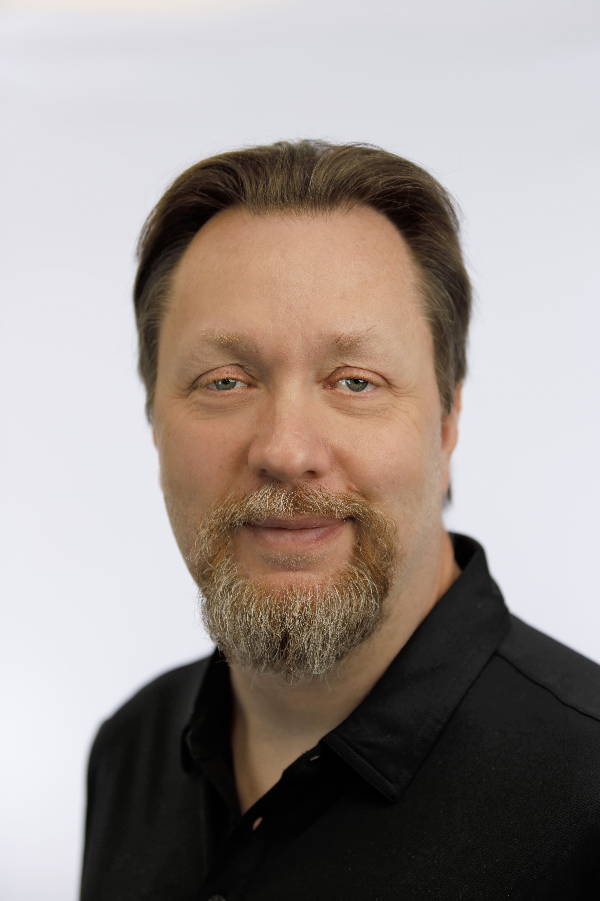

  
  

    <em style="font-size: 0.9em;">"Designing for today. Anticipating tomorrow."</em>
  

# About Me

## In Brief

I’m a principal-level infrastructure architect and dual CCIE with more than 25 years in enterprise infrastructure, including more than 15 years in architecture roles spanning networking, data center, cloud, and security.

My foundation is deep enterprise networking and data center architecture, but my current work increasingly intersects with AI infrastructure, automation, and governed agentic systems. I am interested in the point where emerging technology stops being theoretical and has to become something that can actually be deployed, operated, secured, observed, and supported.

At my best, I work between strategy and implementation: separating assumptions from facts, identifying the constraints that matter, validating where necessary, and turning uncertain technology into architecture that can be defended technically.

---

## Architecture Foundation

My career started in hands-on engineering and grew into enterprise network architecture, data center design, hybrid and multi-cloud connectivity, segmentation, resiliency, security integration, and infrastructure automation.

That foundation still shapes how I approach newer systems.

I care about architecture that works under real operational conditions. Designs should be understandable, maintainable, resilient, and explicit about their limits. Technical complexity is sometimes necessary, but complexity itself is never the goal.

I also work deliberately across adjacent domains. Networking, cloud, security, compute, applications, identity, operations, and automation increasingly overlap, and important architecture problems often appear at those boundaries rather than inside a single technology silo.

---

## Current Architecture Work & Research

My professional architecture work increasingly intersects with AI infrastructure requirements, while my independent research goes deeper into the systems required to operate AI reliably.

Hands-on research includes multi-GPU NVIDIA systems, Mixture-of-Experts observability, NCCL and DDP communication, NUMA and PCIe topology, GPU placement, RoCEv2 and lossless Ethernet behavior, and GPU-to-network observability.

I am also exploring governed agentic infrastructure: Model Context Protocol (MCP), identity and authorization for AI agents, trusted infrastructure data, deterministic execution boundaries, policy enforcement, workload isolation, and enterprise Kubernetes patterns for AI infrastructure and agentic systems.

The common thread is not a particular product or platform. It is understanding where an architecture works, where it stops working, what evidence supports the conclusion, and what should be carried forward into the next design.

[Explore Selected Work](index.md#selected-work)

---

## How I Work

I use design, implementation, lab validation, measurement, and documented decisions as tools for reducing uncertainty.

Sometimes the result is a validated architecture. Sometimes the useful outcome is discovering that an abstraction, implementation, or assumption does not justify further investment. I consider both valid results when the evidence is clear.

Automation follows the same principle. I use infrastructure-as-code, APIs, Python, Ansible, and NetDevOps practices to improve repeatability and reduce ambiguity, but automation should remain understandable and governable. As AI becomes part of infrastructure operations, the important question is not only what can be automated, but where judgment ends and authority begins.

I also view architecture as an enablement function. Good architecture should leave behind enough context, standards, evidence, and shared understanding that other engineers can implement, operate, challenge, and improve it without depending on one person to interpret it forever.

- [Architectural Philosophy](architectural-philosophy.md)
- [Architecture Practice & Leadership](portfolio/architecture-practice.md)

---

## Technical Communication

I am a published technical author and former instructor with experience translating complex technical subjects into practical guidance.

I have authored technical books covering Cisco networking technologies and have delivered technical instruction for Cisco, Microsoft, and Learning Tree across networking, systems, and programming topics.

That experience continues to influence how I document architecture today: explain the decision, make the assumptions visible, show the evidence, and leave enough context for someone else to understand why the design exists.

---

## Closing

I remain most interested in architecture problems that are not fully settled yet.

The technologies change. The method is more durable: understand the problem, test the assumptions, gather credible evidence, and make the next decision explicit.
