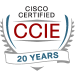

  <h1 style="margin-bottom: 0.2em;">Robert N. Myhre, CCIE #9837 (Active)</h1>
  
<strong>Principal Network & Cloud Networking Architect</strong>

  
✉️ ccie9837@gmail.com

  
🔗 <a href="https://www.linkedin.com/in/robert-n-myhre">LinkedIn</a>

  

---

# Welcome

## Executive Summary

I’m a Network and Cloud **Networking** Architect with over 15 years of experience in architectural roles, building scalable, secure infrastructure across enterprise, healthcare, and multi-cloud environments. My **CCIE certification (held continuously for 23 years and currently active)** underscores a long-standing foundation in networking that informs and elevates my architectural decisions—grounded in deep technical understanding, yet focused on scalable, policy-driven outcomes.

I specialize in data center architecture, hybrid and multi-cloud network design, and secure connectivity between cloud and on-prem environments. My architectural decisions are rooted in scalability, simplicity, and maintainability—favoring best-of-breed solutions that meet business and operational needs. I leverage infrastructure-as-code and NetDevOps principles to accelerate delivery and consistency, and have designed repeatable frameworks across public cloud platforms and traditional enterprise networks. My experience also includes campus segmentation strategies (SDA, ISE) and automation-enabled underlay deployments.

Currently seeking a **fully remote, part-time (~20 hrs/week)** architecture role supporting network transformation, hybrid cloud adoption, or cross-platform integration initiatives.

---

## Project Spotlights

- [Dual Data Center Architecture with Cisco ACI](projects/dc-aci-project.md)
- [Azure Multi-Cloud Expansion with Terraform](projects/multicloud-terraform.md)
- [Multi-Cloud Connectivity via Megaport MCRs](projects/multicloud-network-architecture.md)
- [SDA-Based East-West Segmentation Strategy (In Progress)](projects/sda-segmentation.md) -->

---

## Beyond the Project Spotlights

For additional areas of impact, including smaller projects, repeatable designs, mentoring, and team enablement:

- [Supporting Highlights](projects/highlights.md)
- [Architecture Leadership & Enablement](projects/leadership.md)
- [Actively Growing In](projects/growth.md)
