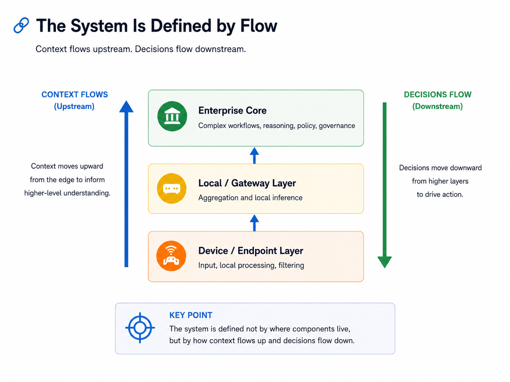

# Intelligence Placement Under Constraint: A Framework for Distributed AI

**Context:** Independent architecture research 
**Status:** Framework retained from a retired white paper 
**Domain:** Distributed AI, intelligence placement, decision flow, governance, observability, failure modes

> This framework originated in a broader white paper exploring distributed intelligence in enterprise environments. The original paper was later retired as the industry moved faster than parts of its framing, but several architectural concepts remained useful: intelligence placement, context and decision flow, silent failure, distributed control boundaries, and constraint-driven architecture.

---

## Overview

As AI moves into enterprise operations, the architecture problem becomes larger than deciding where to host a model.

Intelligence may execute across endpoints, local or edge infrastructure, enterprise platforms, and centralized model environments. Each location offers different advantages and constraints.

The useful architectural question is therefore not:

> Where should the AI platform live?

It is:

> **Where should a particular form of intelligence execute, given the constraints of the environment?**

Those constraints can include latency, data locality, governance, cost, resilience, operational complexity, and trust.

The framework treats centralized and distributed intelligence as complementary patterns rather than competing architectures.

---

## Intelligence Placement as an Architecture Decision

A useful way to reason about distributed AI is as a set of execution layers.

### Device or endpoint

The closest layer to the user, sensor, or source of data.

This layer is useful when:

- latency must be very low
- connectivity may be unreliable
- sensitive data should remain local
- filtering or preprocessing can reduce what must travel upstream

### Local or gateway infrastructure

A site-local or regional layer with more compute and broader context than an endpoint.

This layer can:

- aggregate signals from multiple sources
- provide local inference or enrichment
- reduce dependence on centralized connectivity
- retain data closer to its source

### Enterprise core

The enterprise layer is likely to remain the primary execution point for many complex AI workflows.

It provides:

- broader organizational context
- access to enterprise systems and data
- stronger governance and audit controls
- more efficient shared compute
- integration across multiple workflows and models

### Model factory

Training, fine-tuning, evaluation, and model lifecycle activities form another layer.

The model factory is not necessarily the center of the operational system. It supplies models and capabilities to the layers where intelligence is actually consumed.

The architecture emerges from how responsibilities are divided across these layers.

---

## The System Is Defined by Flow

Component placement alone does not describe the behavior of a distributed AI system.

The more useful model is flow.

**Context flows upstream.**

Signals are captured, filtered, enriched, retrieved, and combined as they move toward systems with broader awareness.

**Decisions flow downstream.**

Recommendations, policies, outputs, and constraints move back toward users, applications, or execution environments.

*Context flows upstream toward broader awareness, while decisions flow downstream toward action.*

There can also be lateral flows between models, agents, tools, or systems operating at the same layer.

This creates an architecture defined not only by connectivity, but by:

- where context is gathered
- where decisions are made
- what information is permitted at each stage
- how decisions are constrained
- where trust boundaries exist
- how failure propagates through the decision process

For infrastructure architects, this is a familiar way of thinking applied to a new object.

Networks have long been understood through flows, constraints, and failure domains.

Distributed AI adds **decision flow** to that model.

---

## Security Becomes a Continuous Property

Traditional infrastructure security often focuses on boundaries: who can connect, what can cross a zone, and which systems can communicate.

AI-driven systems introduce additional questions.

A request may influence data retrieval, model reasoning, external tools, or infrastructure actions.

Security therefore has to consider:

- **Intent** — what is the request attempting to accomplish?
- **Context** — what information may be accessed?
- **Action** — what is the system permitted to do?
- **Outcome** — how is the resulting output validated?

Controls may need to exist at multiple points in the system rather than at one centralized boundary.

That can include:

- prompt and intent controls
- dynamic context scoping
- tool and action authorization
- deterministic policy enforcement
- output validation
- auditing and traceability

The security architecture increasingly follows the decision flow itself.

---

## Silent Failure and Decision Observability

One of the more important differences between traditional infrastructure and AI-driven systems is that a system can be technically healthy while producing a degraded decision.

Consider a system that successfully answers a request but was unable to retrieve part of the required operational context.

Traditional monitoring may report:

- the service is available
- latency is normal
- the request completed
- no dependency reported an outage

Yet the recommendation may have been generated from incomplete information.

The system is operational, but its **decision conditions are degraded**.

This creates a class of silent failures that normal infrastructure monitoring does not fully expose.

A useful distinction is:

> **Infrastructure observability asks whether the system is functioning.**

> **Decision observability asks under what conditions the decision was made.**

Meaningful AI observability may therefore need to include:

- context completeness
- data lineage
- decision traceability
- model confidence
- confidence in the data used by the model
- visibility into degraded decision conditions

Availability alone is not enough.

---

## Constraints as Forcing Functions

Distributed AI architecture is not determined only by technical possibility.

Several forces shape where intelligence can realistically execute.

### Latency

Some decisions benefit from local execution because centralized inference introduces unacceptable delay.

### Data locality and governance

Policy, privacy, regulatory, or operational boundaries may limit where information can move.

### Cost

Centralized infrastructure can provide higher utilization and simpler operations. Distributed execution may improve locality or resilience while increasing infrastructure and management cost.

### Operational complexity

Every additional execution environment creates lifecycle, observability, support, and coordination requirements.

### Vendor and platform dependency

Enterprise AI systems will often combine internal systems with external models, platforms, and managed services. Those dependencies can reduce visibility or architectural control.

### Trust

A technically capable system may still fail operationally if the people responsible for outcomes cannot understand or trust its behavior.

These constraints do not produce one ideal architecture.

They determine which combination of centralized and distributed patterns is practical.

---

## Architectural Finding

> **Centralized and distributed intelligence are not opposing architecture choices.**

Centralization often provides:

- operational simplicity
- stronger governance
- shared infrastructure efficiency
- easier auditing and lifecycle management

Distribution can provide:

- lower latency
- stronger locality
- resilience to connectivity constraints
- tighter control over sensitive information

Most enterprise architectures will likely combine both.

The architectural task is to determine **which intelligence belongs where, under which constraints, and with which control boundaries**.

---

## What This Framework Demonstrates

This work was not intended as a prediction of a particular distributed-AI product architecture.

It was an attempt to create a reusable way to reason about systems whose correctness increasingly depends on more than moving data successfully.

The durable questions are:

- Where is intelligence placed?
- What context is available at each layer?
- How do context and decisions move?
- Where are authority and control applied?
- What failures remain invisible to normal monitoring?
- Which constraints determine whether distribution is actually justified?

Technologies and platforms will continue to change.

Those questions remain useful because they focus on the structure and behavior of the system rather than on a particular implementation.