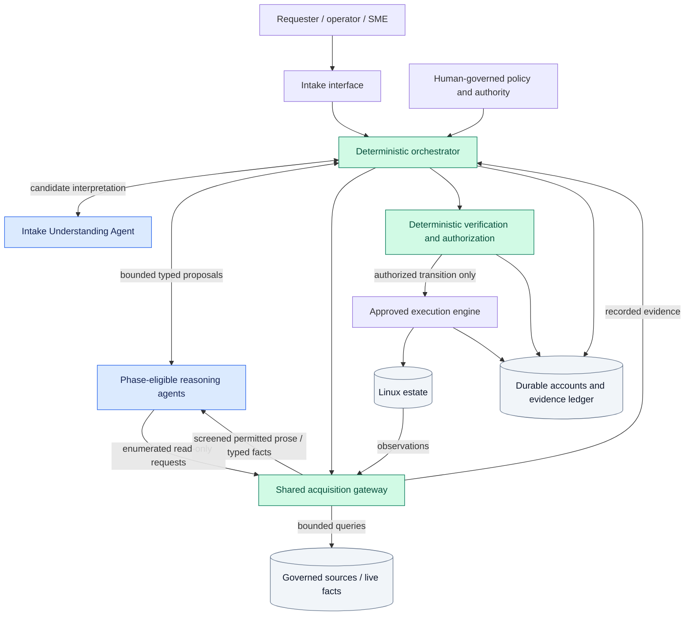
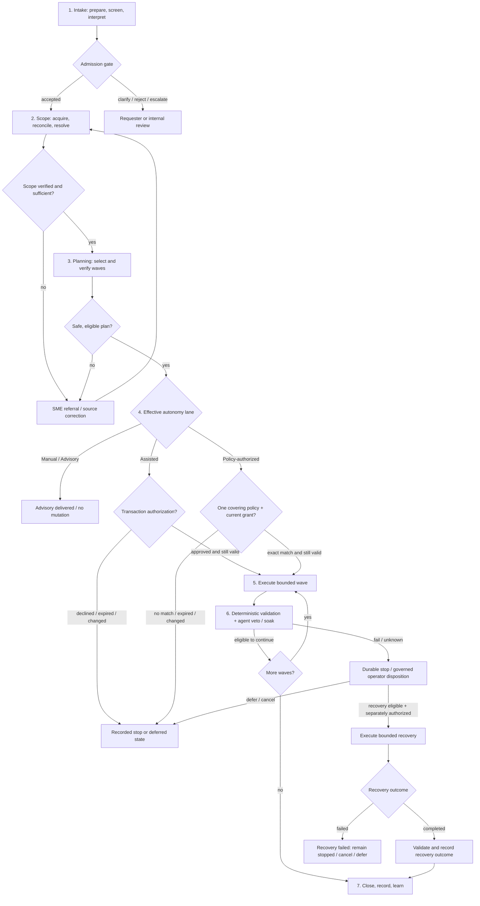
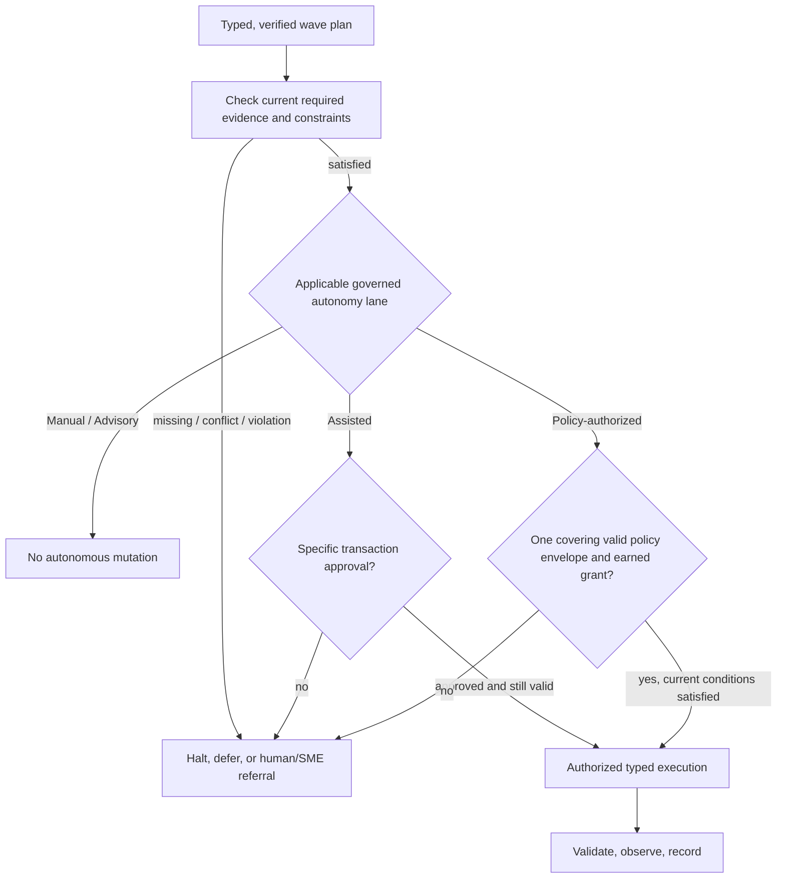
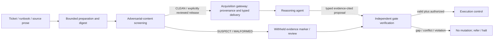

# Project Sentinel

## A Reference Architecture for Governed Agentic Infrastructure Operations

*An evidence-based autonomy and deterministic-control model, illustrated through Linux patching*

**Version:** 1.0 public  
**Status:** Proposed reference architecture; not production-validated  
**Author:** Robert N. Myhre  
**Source baseline:** Project Sentinel Reference Architecture v3.5

**Relationship to Project Boundary.** [Project Boundary](../projects/project-boundary.md) is the public case study for the architecture research effort in which Project Sentinel was developed. This document is the distilled public Reference Architecture from that same work. [Selected supporting evidence](https://github.com/Robert-N-Myhre/project-boundary-evidence) is published separately so architecture intent, research narrative, and implementation evidence remain distinct artifacts.

> **Status and claims.** This is a proposed reference architecture distilled from Project Sentinel v3.5. It does not claim production deployment, measured reduction in operating effort, or proven immunity to prompt injection. Some controls have prototype realizations, but production safety, effectiveness, and portability remain subjects of verification. The diagrams describe logical boundaries, not a single mandated product topology.

## 1. Executive overview

**Architectural question:** How can an AI system make consequential decisions about production infrastructure without receiving uncontrolled authority over that infrastructure?

Infrastructure automation already executes well-defined actions. The harder problem is deciding *what should happen, to which systems, in which order, under what evidence, and with what recourse when reality differs from expectation*. Enterprise Linux patching illustrates this gap. A technically successful package installation can still break an application because ownership, dependencies, availability constraints, or validation were misunderstood.

Project Sentinel proposes a governed control system around existing patch tooling. Specialized reasoning agents interpret requests, resolve ambiguous scope, select bounded patch waves, recognize anomalies, and propose lessons from observed outcomes. Deterministic controls acquire required evidence independently, verify claims and constraints, apply human-governed authorization, and manage progression and recovery. An approved execution engine—not the agents—changes infrastructure.

The central thesis is:

> **AI may choose within the envelope. It may not define, widen, waive, or escape the envelope.**

The intended benefit is less human *between-decision labor*, followed by fewer transaction approvals only where a specific operation class has earned standing authorization. Human responsibility shifts toward policy design, exceptional decisions, source correction, and recovery. This is a design hypothesis to measure, not an established operational outcome.

**Scope.** The concrete workload is orchestrated Linux patching through existing enterprise facilities such as Ansible Automation Platform (AAP), package-management services, application checks, and SME-authored playbooks. The underlying control patterns may apply more broadly, but transfer to other operation classes has not yet been established.

## 2. Architectural context and quality attributes

A patching engine can run jobs but cannot independently prove that a wave preserves a service's quorum, that a host belongs to the intended application, or that post-change health is acceptable. An unconstrained AI agent may reason about those questions, but that reasoning does not itself establish authority or factual correctness. A permanent human sign-off for every machine choice avoids some authority problems but leaves much of the labor untouched.

Sentinel therefore makes six quality attributes central to the design:

| Attribute | Architectural requirement |
|---|---|
| **Safety** | Mutation is bounded by current, verified service and execution constraints. |
| **Authority integrity** | Reasoning cannot self-authorize, rewrite policy, or invoke a mutator. |
| **Context integrity** | Untrusted text is screened, provenance-bound, and cannot create permissions. |
| **Auditability** | Every consequential decision has attributable inputs, policy basis, identity, and outcome. |
| **Recoverability** | Interruptions preserve durable state and yield explicit, authorized operator exits. |
| **Progressive autonomy** | Evidence can support narrowly scoped promotion; deteriorating evidence forces demotion. |

The architecture protects two interconnected planes: **patch safety**, concerned with what may happen to hosts and applications, and **AI context integrity**, concerned with what may influence reasoning and consequential selections. Neither plane substitutes for the other.

## 3. Architectural principles

These principles are normative design intent; a deployment must demonstrate their enforcement.

1. **Consequential reasoning without self-authorization.** Agents may choose among governed alternatives, but may not grant or extend their own authority.
2. **Deterministic progression and single mutation control.** One logically authoritative orchestrator controls a run; only an approved execution interface mutates the estate. Active host mutation authority is exclusive across runs.
3. **Required evidence is not discretionary.** A deterministic gate or defense independently acquires the evidence it needs. Agent-selected retrieval adds context but cannot starve the gate.
4. **Trust belongs to the content field, not its source label.** Free text from a ticket, runbook, or governed inventory is still untrusted prose; verified provenance establishes origin, not factual truth.
5. **Reconcile before touch.** Recorded intended state is checked against current operational facts and independently governed constraints before mutation.
6. **Autonomy is earned by operation class.** Workload tier, evidence quality, provenance, and approved grants bound the effective lane. Promotion requires governance; demotion can occur deterministically.
7. **Consequential actions must be attributable, stoppable, and recoverable.** Authorization binds a defined plan and scope; failure and recovery follow recorded paths with independent authority where required.

## 4. Conceptual architecture

The model has three paths: **reasoning** (probabilistic judgments), **control** (deterministic state and constraint enforcement), and **authority** (human-governed policy and recorded human decisions). Agents influence operations by emitting typed, evidence-cited artifacts; they do not own credentials or reach execution endpoints directly.

**Diagram reading note.** The Intake Understanding Agent is deliberately outside the governed-source acquisition path. The grouped **phase-eligible reasoning agents** represent only reasoning roles that are permitted to use a gateway roster in their current phase. Each phase has a separately enforced tool roster, source context, content policy, evidence-account identity, and call budget; one phase cannot inherit another phase's source reach. The arrows are logical information/control relationships, not unmediated network paths, and no agent can direct gateway results around orchestrator verification.

### Component responsibilities

| Component | Responsibility | Explicit limit |
|---|---|---|
| **Intake Understanding Agent** | Structures permitted requester intent into a candidate contract with gaps and source references. | Cannot admit its own request or access enterprise sources. |
| **Context & Scope Agent** | Selects bounded read-only lookups; proposes host identities, application mapping, sufficiency, and gaps. | Cannot adjudicate hard source conflicts or invent authoritative facts. |
| **Planning & Risk Agent** | Selects wave grouping, order, validation packages, and recovery strategies from governed options. | Cannot expand policy constraints or authorize its plan. |
| **Validation Anomaly Agent** | Interprets bounded post-change evidence and flags anomalies or insufficient context. | **Veto-only:** never creates affirmative PASS. |
| **Learning & Evidence Agent** | Proposes risk associations, source corrections, and autonomy evidence from actual outcomes. | Cannot rewrite policy, grant autonomy, or invent observed executions. |
| **Acquisition gateway** | Enforces read-only enumerated tools, phase isolation, field-level text screening, provenance, and recording. | Cannot provide arbitrary unrestricted agent access or pass flagged prose by default. |
| **Orchestrator and gates** | Owns admission, stage transitions, required evidence floor, verification, authorization checks, bounded retries, and stops. | Cannot treat an unverified proposal as authority. |
| **Execution engine** | Runs approved patch/recovery capabilities against named targets. | Receives authorized typed operations, not free-form agent commands. |
| **Durable records** | Preserve correlations, stage accounts, decisions, evidence identity, execution and recovery outcomes. | Recorded content is not automatically reusable prompt context. |

## 5. Operational lifecycle

A complete change proceeds through distinct stages. A successful earlier stage never silently authorizes a later one.

### 5.1 Intake is an admission boundary

Every submission receives a pre-acceptance correlation identity, but not a durable change/run identity until accepted. Incoming free text is prepared, bounded, screened, and tied to exact content digests. The screener returns a verdict and coverage—not a replacement copy of the content. An Intake Understanding Agent produces a **candidate** interpretation; the orchestrator separately validates structure and provenance and determines whether the contract is **sufficient**. Unverified interpretation fields become explicit gaps rather than accepted facts. Free-text clarification re-enters the same controls.

Scheduled requests do **not** bypass intake because they came from a scheduler. Their failure disposition is stricter where unattended submissions might otherwise overwhelm human review. Infrastructure processing outages remain visible failures, not silent request rejections.

### 5.2 Scope is evidence-grounded, not merely plausible

Before reasoning, the orchestrator directs acquisition of the gate-required minimum, including recorded absence when a governed lookup has no result. The Context Agent may request more evidence via bounded read-only gateway tools. Claims are checked against the recorded results for that invocation. Identity and tier require appropriate Source-of-Truth evidence; source conflicts and hard blockers are handled deterministically. Missing or withheld evidence is a gap, not license to guess. An unresolved accepted run is **referred to an SME**, rather than casually discarded or silently trimmed.

### 5.3 Planning is consequential but constrained

The Planning Agent chooses which eligible hosts form waves, their sequence, and appropriate governed validation and recovery options. Required safety inputs are acquired independently of agent discretion. The orchestrator checks failure domains, quorum, concurrency, hard constraints, allowed option identifiers, and policy eligibility. If a relevant governed constraint is genuinely absent, an attributable, run-scoped SME supplement can fill that absence, but cannot override an existing governed rule; the system then replans. Missing-constraint work remains visible for later governance.

### 5.4 Authority disposition and execution remain separate

A verified plan is not an executable permission. The effective autonomy lane first determines what consequence is available. **Manual** and **Advisory** have no agent-directed mutation authorization path; Advisory may end as a useful, recorded delivery outcome without implying full run completion. **Assisted** requires a transaction authorization for the specific plan. **Policy-authorized** requires one exact, current standing-policy match and an eligible operation-class grant.

Where mutation is permitted, authorization binds the precise scope and plan identity. The execution interface receives only a typed, authorized transition. Before mutation, applicable current conditions must still satisfy the required safety and authorization rules. The control model provides logically single-run authority and exclusive active mutation authority for a host across runs.

### 5.5 Validation is affirmative evidence plus subtractive reasoning

Mandatory deterministic checks constitute affirmative health evidence. The Validation Agent may flag an anomaly or declare insufficient context but may not turn a failed check into PASS. Wave-level outcomes are composed into the run-level disposition. Soak periods distinguish immediate technical recovery from delayed application impact. A stop is durable and has an explicit operator exit; recovery mutation requires separately recorded authority. A prototype may operate with deterministic-only validation and a human continuation decision, but that is not equivalent to the full target-state automatic-continuation contract.

### 5.6 Learning is bounded by what happened

The learning loop records executed scope, actual outcomes, exceptions, recovery, and validation coverage. It may propose better planning or candidate autonomy promotion based on relevant outcome evidence, but cannot alter governed hard rules or promote its own lane. A future increase in autonomy remains a human-governed decision.

## 6. Authority and earned autonomy

Sentinel distinguishes **transaction authorization** for a particular plan from **standing authorization** granted to a narrow operation class. Each mutation must cite exactly one valid authorization source. A recovery mutation requires a **distinct human recovery authorization** bound to the verified plan and selected recovery strategy; it does not widen, replace, or modify the original patch authorization.

### Authority hierarchy

The Reference Architecture defines the authority structure and invariants. Organization-governed policy instantiates the permitted workload-tier ceilings, operation classes, policy envelopes, thresholds, and evidence-backed grants. Runtime deterministic logic derives the effective lane from those governed inputs and current evidence. Runtime state may narrow or suspend authority when conditions deteriorate; it may not widen the authority established by governed policy.

An authorization-relevant operation or change classification must come from an attributable governed declaration or bounded confirmation. A reasoning model may infer a candidate classification for interpretation, but a model-only classification is insufficient to establish standing authority.

### Autonomy ladder

| Lane | Agent contribution | Consequence |
|---|---|---|
| **Manual** | May be observed for evaluation. | Human-led work; no agent-driven mutation path. |
| **Advisory** | Produces proposals for consideration. | Human acts outside agent-directed mutation. |
| **Assisted** | Provides a verified, bounded operation package. | Human authorizes the specific mutation. |
| **Policy-authorized** | Selects within a previously governed envelope. | Matching operations may proceed without a new approval click. |
| **Suspended** | May help diagnose and propose remediation. | Mutation eligibility is revoked. |

The operation class—not a host or model in isolation—is the unit of autonomy. Tier policy establishes a ceiling; provenance and representative operational evidence determine the attainable position. Tier 1 retains CAB-governed treatment; a narrow standard-change designation is required before standing authorization is possible. An agent-extracted eligibility claim cannot itself establish policy-authorized standing. Promotion is a governed human act; loss of required evidence can cause immediate deterministic demotion or suspension.

**Policy selection must not be arbitrary.** An eligible wave requires one unambiguous covering envelope rather than silently combining convenient clauses from multiple overlapping policies. A mixed-tier run without one such cover is referred rather than auto-authorized. This is a current deliberate boundary, not an implicit promise of multi-policy composition.

## 7. Evidence and AI context integrity

Sentinel treats prompt-injection resistance as an architectural boundary problem, not a classifier-accuracy problem.

The gateway distinguishes enumerable typed fields from free text—even within a governed Source-of-Truth system. Free text takes the screening path. Flagged prose is withheld from ordinary model context, leaving a digest-linked marker and an explicit evidence gap. A human release is a separately recorded disposition that does not erase the original verdict. The exact text actually delivered to an agent is durably accounted for; that audit store is **not** an alternate retrieval route back into a prompt.

Provenance has distinct meanings: the cited content must exist in the bound artifact (**integrity**); it must support the interpretation (**adequacy**); and an operational claim must independently reflect reality (**truth**). A CLEAN verdict is not a grant of trust or autonomy. A missed injection could corrupt an agent's *proposal*, but the surrounding controls are designed to prevent it from directly becoming policy, credentials, or mutation authority.

The design also constrains inference-runtime state, model tool access, credentials, consequential configuration, and records of each security control that actually ran. Merely claiming that content was screened is not evidence of screening.

## 8. Failure, interruption, and recovery

The default response to uncertainty is a recorded stop or referral, not optimistic continuation. Distinct failures require distinct dispositions:

| Situation | Required behavior |
|---|---|
| Unparseable intake or unavailable security control | Recorded processing failure or review; do not pretend the input passed. |
| Scope conflict or missing minimum host evidence | Refer accepted work for source correction/reassessment; no silent host deletion. |
| Missing or contradictory safety constraint | Stop planning; supplement only genuine absences and replan. |
| Policy expired, scope changed, or authority insufficient | No mutation under the obsolete or insufficient authority basis. |
| Execution interruption or ambiguous external outcome | Reconcile external state and prior durable account before retrying. |
| Required validation fails or is undetermined | Halt/hold according to governed conditions; don't infer PASS. |
| Recovery needed | Obtain a specifically scoped recovery decision and reconcile before recovery mutation. |

The design requires crash-safe correlation of planned work, dispatched jobs, observed effects, and recovery decisions. An interrupted coordinator must not restart mutation simply because it lost its own transient state. Operator exits are explicitly enumerated, attributable, and constrained by the type of stop. Successful recovery ends further patch-wave progression for that run but still permits validation, outcome recording, and learning to describe what actually occurred. Failed recovery remains an explicit stopped state; it does not authorize an automatic retry or continuation.

**Open architecture question:** The exact requirements for refreshing all authorization-defining evidence between early scope assessment, plan verification, approval, and the instant of mutation still need a single unified validity contract. The reference model requires rechecking critical current conditions; the full invalidation and selective revalidation semantics are not yet claimed as complete.

## 9. Worked example: patching a redundant application service

Consider four Linux hosts serving a fictional application, spread across two failure domains. The requester asks to apply routine security updates. The example is illustrative, not evidence of a successful field deployment.

1. **Intake:** The request is screened and interpreted. A missing service name is clarified; the accepted contract retains references to the original text and the confirmation.
2. **Scope:** Governed inventory establishes the four host identities and tiers. Live facts are obtained independently. An uncertain ownership note remains screened, source-cited untrusted prose; it cannot override a typed inventory record.
3. **Planning:** The agent selects two waves that avoid simultaneous mutation of correlated failure domains and selects allowed validation/recovery packages. The gate independently checks the source-backed failure-domain constraints.
4. **Authorization:** If the operation class has a current earned standing grant and one valid covering envelope, the bounded waves may be policy-authorized. Otherwise, a human approves the verified plan at the appropriate lane; the plan is not silently recomputed after approval.
5. **Execution and validation:** The executor patches Wave 1. Deterministic health checks establish that service behavior remains inside the required envelope; the anomaly agent may still stop progression if it detects unexplained changes.
6. **Exception:** Suppose an application check fails after the first wave. The system halts the remaining work. It records which hosts were actually changed and requests a separately scoped recovery decision rather than treating the original patch authorization as unrestricted rollback permission.
7. **Learning:** Only observed hosts and actual outcomes feed the record. This failure may reduce operation-class eligibility until corrected and revalidated.

The point is not that an AI guessed the correct wave order. It is that **a real AI selection can influence execution, while independent evidence, policy, and recovery boundaries determine what the selection is allowed to cause**.

## 10. Architectural tradeoffs and rejected shortcuts

| Design choice | Why | Cost / limitation |
|---|---|---|
| Separate intake from context resolution | Minimize raw-request agent reach and preserve admission semantics. | More contracts and distinct pre-acceptance records. |
| Require deterministic evidence acquisition | A safety defense cannot rely on an agent choosing to fetch its trigger. | More predictable acquisition load and gate-specific source dependencies. |
| Screen free text from governed systems | A trusted system can still store attacker-controlled prose. | Withheld context may increase unresolved gaps and referrals. |
| Keep authority outside reasoning | Prevent model output and confidence from granting mutation permission. | More deterministic contracts, policy governance, and operator interaction initially. |
| Require a single covering envelope | Avoid ambiguous policy precedence and privilege composition. | Mixed-tier or complex scopes may require referral or separate work. |
| Separate recovery authorization | Patch permission does not imply unlimited undo capability. | Explicit human decisions during exceptional recovery. |
| Earn standing authorization | Reduce approval count only where outcome evidence warrants it. | Initial manual/advisory/assisted cycles remain necessary. |

The system deliberately does **not** attempt to replace established patch mechanics or SME-defined service safety with model improvisation. It also does not assume all operational knowledge can be converted into clean, authoritative facts.

## 11. Validation strategy and research questions

The architecture is a set of testable control claims. A conformance or research program should seek disconfirming evidence, especially when source data are stale, hostile, contradictory, or incomplete.

| Claim to test | Representative proof obligation |
|---|---|
| Agent output cannot authorize its own mutation | Inject forged approvals or policy IDs into all agent outputs; verify execution rejects them. |
| Required gate evidence is not discretionary | Suppress all optional agent tool calls; verify hard blockers still activate from deterministic acquisition. |
| Untrusted text cannot silently become a privileged fact | Place hostile prose in tickets, inventory comments, and retrieved notes; confirm withholding, provenance, and bounded consequences. |
| Source conflicts fail safely | Make governed inventory disagree with live facts; verify no unsupported automatic scope acceptance or mutation. |
| Mutation authority is exclusive | Introduce simultaneous runs and coordinator failover; prove fencing or equivalent host ownership control. |
| Approval binds immutable scope | Change wave membership or a governing policy after approval; verify the old authorization cannot silently cover a new plan. |
| Validation cannot manufacture PASS | Remove mandatory evidence or return an agent `NO_ANOMALY` alongside failed deterministic checks. |
| Recovery is separately governed | Interrupt execution, duplicate callbacks, and replay recovery requests; prove no unauthorized second mutation. |
| Earned autonomy depends on representative evidence | Supply mismatched historical outcomes or agent-only eligibility claims; confirm no promotion. |

**Additional research questions** include the cost of false screening positives, semantic provenance adequacy, human review burden, freshness windows for current authority, and whether the model transfers to operation classes other than Linux patching without eroding its boundaries.

### Operational efficacy measures

The intended reduction in human between-decision labor should be evaluated independently from control conformance. Representative measures include:

- human hours per patch cycle;
- human decisions per hundred hosts or waves;
- approval-preparation time;
- agent-selected plan rewrite or override rate;
- referral and exception rate;
- recovery and rollback rate;
- false-pass or delayed-failure rate;
- and the percentage of eligible waves that progress under standing authorization without a transaction-level human act.

These measures test whether the architecture is reducing operational effort without hiding additional risk or merely moving work into exception handling.

The success criteria should separate (a) **control conformance**—proof that guards cannot be bypassed in tested scenarios—from (b) **operational efficacy**—measured patch outcomes, recovery, lead time, and human effort. A functioning prototype or extensive test suite alone establishes neither generalized production safety nor realized human-time savings.

## 12. Applicability, limitations, and conclusion

Sentinel is best suited to operational activities with repeatable execution contracts, governable safety constraints, observable outcomes, and meaningful opportunities for agent judgment. It is less suitable where safe execution cannot be verified, rollback is speculative, identity and ownership are fundamentally unresolved, or the authority regime does not allow standing policy delegation.

The reference architecture remains intentionally bounded. It does not specify a production HA/fencing realization, every source-specific freshness rule, every policy exception, an exhaustive implementation state machine, or a generalized multi-operation workflow platform. These belong to further architecture decisions and engineering verification rather than being assumed solved.

**Concluding position.** The architectural contribution is not an AI agent that patches Linux. It is a proposed way to let AI reasoning **matter** operationally while withholding from that reasoning the authority to define what is allowed. If independent evidence, constrained selection, governable authorization, deterministic progression, and recoverable execution all hold, higher autonomy becomes an evidence-backed consequence of operating well rather than a privilege asserted by a model.

## Related public artifacts

- [Project Boundary — Governing Consequential Automation](../projects/project-boundary.md) — the case study describing the architecture investigation, key discoveries, and why implementation stopped.
- [Project Boundary Evidence](https://github.com/Robert-N-Myhre/project-boundary-evidence) — selected contemporaneous decisions, executable validation, run artifacts, negative evidence, and project stop-state records supporting the public claims.

---

*Document provenance: public-facing synthesis of Project Sentinel Reference Architecture v3.5. This document is intentionally readable without access to the underlying repository or private architecture history. Detailed contracts, implementation evidence, and research artifacts should be published separately where cleared for public release.*