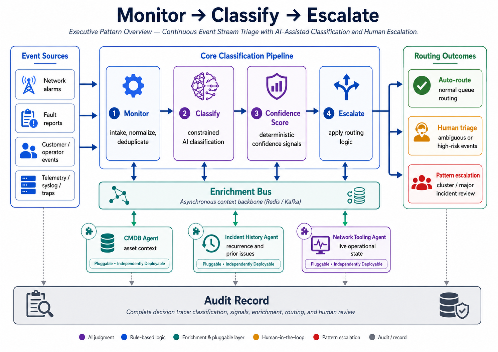
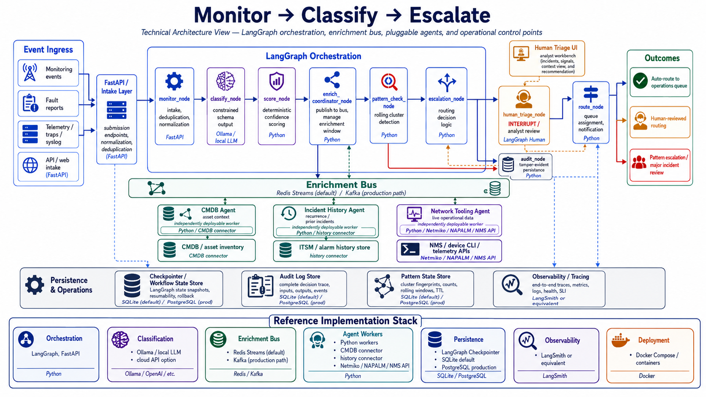
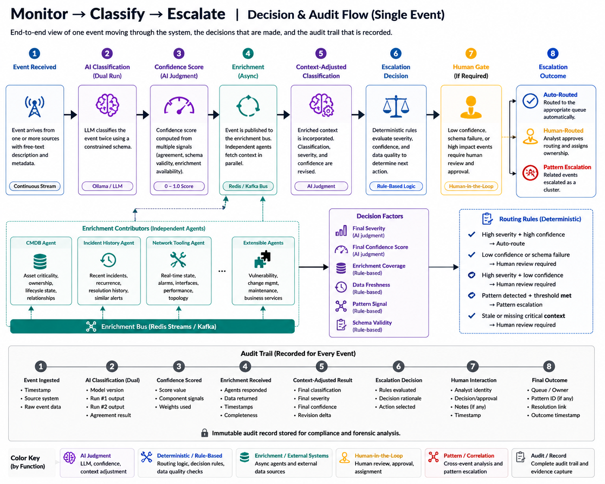

# Monitor → Classify → Escalate

**Continuous Event Stream Triage with AI-Assisted Classification and Human Escalation**

The **Monitor → Classify → Escalate** pattern addresses business processes that operate on continuous event streams rather than discrete submitted documents. Events arrive unpredictably, require interpretation, often need context from external systems, and may only become meaningful when viewed as part of a larger pattern.

This reference architecture uses **AI-assisted classification**, **deterministic confidence scoring**, **pluggable enrichment agents**, **human approval gates**, and **complete auditability** to support event triage in environments where routing accuracy, operational context, and escalation discipline matter.

[Download the full reference architecture PDF](../assets/reference-architectures/monitor-classify-escalate/mce-reference-architecture.pdf)

> This is a reference architecture, not a turnkey implementation. Production use requires adaptation to the target organization's event sources, data classification policy, operational workflow, security model, SLA requirements, and staffing model.

---

## Reference scenario

The reference scenario is **AI-assisted network operations event triage**.

The pattern applies to incoming network alarms, operator or customer fault reports, telemetry events, syslog/trap streams, and ambiguous operational events that require classification and routing under time pressure.

The same architecture can be adapted to other verticals, but the vocabulary, enrichment sources, governance model, and confidence scoring thresholds must be tuned to the organization.

---

## When this pattern fits

This pattern is useful when at least two of the following are true:

- Events arrive continuously and cannot wait for batch processing.
- Event descriptions include free-text or inconsistent terminology.
- Correct classification depends on context outside the original event.
- Related events across time or source may indicate a larger incident.
- Misrouting creates measurable time, SLA, or operational cost.
- Ambiguous or high-risk cases can pause for human review.

This pattern is a poor fit when events are fully structured, deterministic rules can express all routing logic, and no external context changes the outcome. In those cases, a simpler rule-based system is usually faster, cheaper, and easier to audit.

---

## Architecture overview

The logical architecture has three main layers:

1. **Core classification pipeline** — monitors incoming events, normalizes them, classifies them using constrained AI output, and computes confidence signals.
2. **Enrichment bus and agents** — asynchronously gathers additional context from independent enrichment agents such as CMDB, incident history, and network tooling.
3. **Escalation and audit layer** — applies deterministic routing logic, invokes human review when required, identifies patterns, and records the full decision trail.

---

## Technical architecture

The reference implementation uses **LangGraph** for orchestration, **FastAPI** for the intake/API layer, **Redis Streams** as the default enrichment bus, and **Kafka** as the recommended production path where replay, durability, or compliance audit requirements are stronger.

Classification may run through a local LLM served by **Ollama** or through a cloud API, depending on data classification policy, latency requirements, and operational cost. Enrichment agents are independently deployable Python workers that connect to existing operational systems.

### Reference implementation stack

| Layer | Reference technologies |
|---|---|
| Orchestration | LangGraph, FastAPI |
| Classification | Ollama/local LLM or cloud API |
| Enrichment bus | Redis Streams default, Kafka production path |
| Agent workers | Python workers, CMDB connector, history connector, Netmiko/NAPALM/NMS API |
| Persistence | LangGraph checkpointer, SQLite default, PostgreSQL production |
| Observability | LangSmith or equivalent tracing |
| Deployment | Docker Compose or container platform |

---

## Key architectural principles

### Constrained AI output

The LLM does not produce routing narratives. It produces structured output from a defined schema: event type, severity, affected layer, affected device, and recommended action. Downstream systems consume structured fields, not free-form explanation.

### Deterministic confidence scoring

Confidence is not based on the model's self-reported certainty. It is computed from observable signals such as classification consistency, affected-device identifiability, severity signal consistency, layer classification confidence, ambiguity flags, and enrichment agreement.

### Pluggable enrichment agents

Enrichment agents subscribe to the bus, retrieve context, and publish their contribution back. The classification pipeline does not need to know which agents exist. Adding a new enrichment source means deploying a new worker, not modifying the core pipeline.

### Human approval gates

Low-confidence, ambiguous, schema-failed, or high-risk events are routed to human review. Pattern detection produces a cluster alert for review; it does not automatically declare a major incident.

### Complete auditability

Every classification attempt, schema validation result, confidence signal, enrichment contribution, routing decision, and human action is recorded. Explainability comes from structured evidence, not model-generated reasoning.

---

## Decision and audit flow

The decision and audit flow shows how one event moves through the architecture: it is received, classified, scored, enriched, re-evaluated, routed or escalated, and recorded for audit.

---

## Production considerations

Before implementation, the architecture must be adapted to the organization's operating model. Key decisions include:

- **Data classification:** whether event data can be sent to a cloud LLM or must remain local.
- **Integration systems:** which CMDB, incident history, network management, and event sources will be used.
- **Entity resolution:** how events map to devices, services, circuits, users, or assets across systems.
- **Workflow ownership:** who owns triage review, pattern escalation, and response SLAs.
- **Model hosting:** local model, cloud API, or private GPU environment.
- **Human escalation policy:** when events require human approval and whether P1 provisional escalation is required.
- **Audit retention:** how long decision records must be retained and whether Kafka-level replay is required.
- **Access controls:** role-based access for triage reviewers, audit reviewers, and enrichment agents.
- **Operational support:** monitoring for bus failures, agent timeouts, schema validation failures, and enrichment latency.
- **Historical validation:** testing the classification model against representative historical events before production use.

---

## Differentiation

This architecture is not differentiated by any single technology. Existing AIOps platforms, event correlation engines, and rules systems address overlapping capabilities.

The differentiation is the combination of:

- constrained AI classification,
- deterministic confidence scoring,
- pluggable enrichment through a bus architecture,
- human gates within the safety model,
- categorized failure handling,
- complete audit traceability.

That combination makes the design easier to reason about, govern, adapt, and review than a black-box AI routing workflow.

---

## Limitations

This reference architecture intentionally defines boundaries:

- It classifies and routes events; it does not resolve them.
- Confidence scoring weights must be calibrated against real event samples.
- Dual-run classification increases inference cost and latency.
- Pattern detection is threshold-based and does not learn new patterns autonomously.
- Enrichment quality depends on source-system quality and identifier normalization.
- Live operational state introduces non-determinism; the audit record is required to reproduce why a decision was made.

---

## Vertical adaptation

The logical pattern is stable across verticals. What changes is the vocabulary, schema fields, enrichment systems, governance model, and confidence calibration.

| Vertical | Example process | Adaptation focus |
|---|---|---|
| Network operations | Alarm triage, fault reports, circuit events | Network inventory, NMS/telemetry, alarm history |
| IT operations | Service ticket triage, incident routing | ITSM context, open incidents, change windows |
| Healthcare | Patient support events, clinical/facilities alerts | Stronger data classification and regulatory review |
| Manufacturing | Equipment faults, production line alerts | OT monitoring, historian/SCADA/DCS integrations |
| Financial services | Trading system alerts, fraud/infrastructure events | Compliance review, stricter audit retention, Kafka likely |
| Telecommunications | Customer fault triage, service degradation | OSS/BSS, network inventory, alarm correlation |

---

## Full reference architecture

The complete PDF includes fit criteria, component responsibilities, message schemas, failure modes, timeout categories, production considerations, security and governance controls, implementation options, auditability model, demonstration scenarios, and vertical adaptation notes.

[Download the full reference architecture PDF](../assets/reference-architectures/monitor-classify-escalate/mce-reference-architecture.pdf)

---

*Requires adaptation before implementation. Not for redistribution without attribution.*
