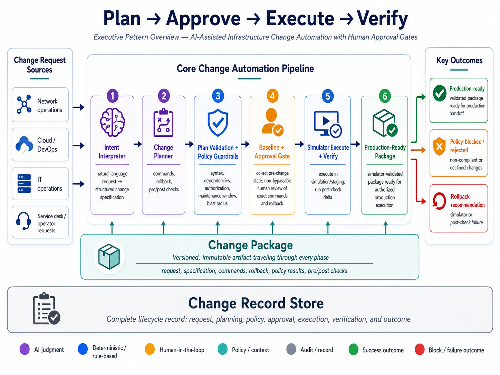
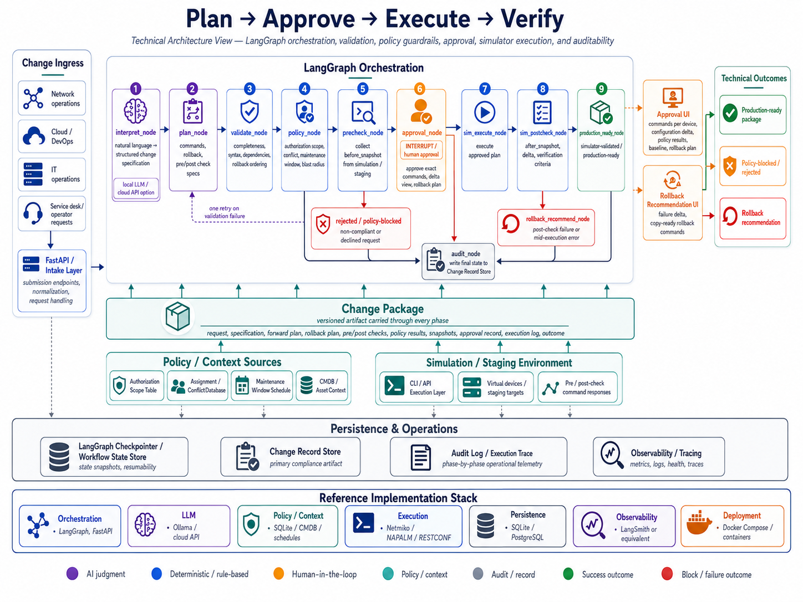
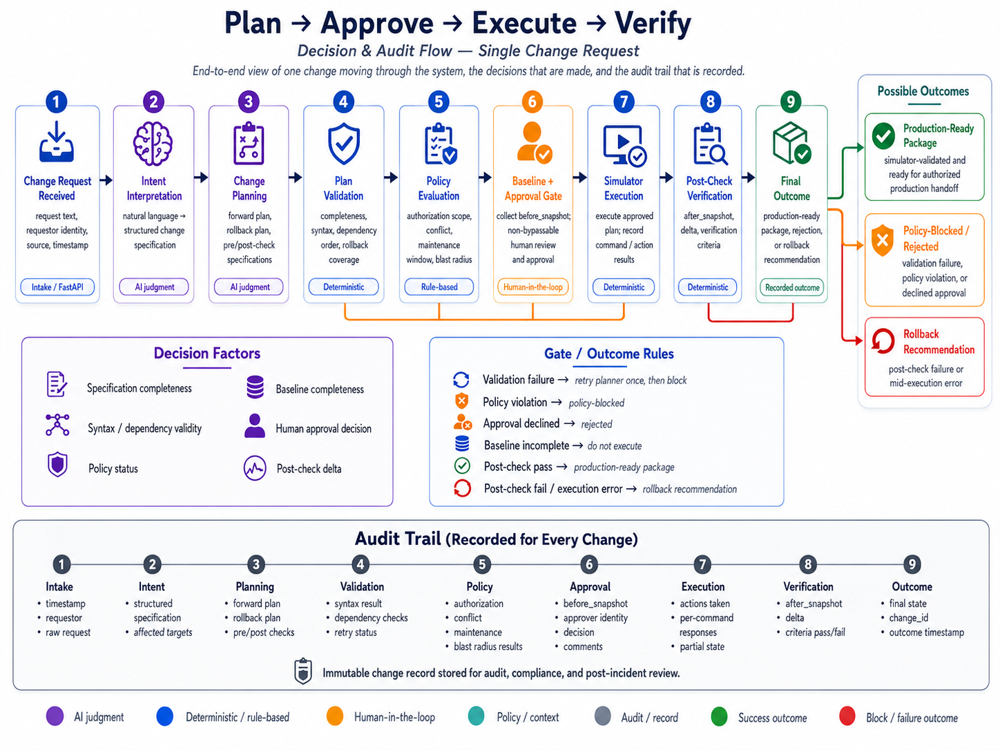

# Plan → Approve → Execute → Verify

**AI-Assisted Infrastructure Change Automation with Human Approval Gates**

The **Plan → Approve → Execute → Verify** pattern addresses infrastructure and IT operations workflows where configuration changes must be interpreted, planned, reviewed, executed, verified, and recorded with a clear rollback path.

This reference architecture uses **AI-assisted intent interpretation**, **structured change planning**, **deterministic plan validation**, **policy guardrails**, **non-bypassable human approval**, **simulator or staging execution**, and a **complete Change Record Store** to support governed infrastructure change automation.

[Download the full reference architecture PDF](../assets/reference-architectures/plan-approve-execute-verify/paev-reference-architecture.pdf)

> This is a reference architecture, not a turnkey implementation. Production use requires adaptation to the target organization's infrastructure environment, data classification policy, operational workflow, security model, SLA requirements, approval model, and staffing capacity.

---

## Reference scenario

The reference scenario is **AI-assisted infrastructure change automation**.

In the network operations example, a user submits a natural language request to add a VLAN, create gateway configuration, update trunk paths, validate the change in a simulation environment, and produce a production-ready change package for authorized execution.

The same architecture can be adapted to cloud, DevOps, IT operations, healthcare, financial services, and telecommunications workflows, but the execution tooling, policy model, verification criteria, and governance requirements must be tuned to the organization.

---

## When this pattern fits

This pattern is useful when at least two of the following are true:

- Change requests contain free-text or inconsistent terminology.
- The change type is repeatable enough to be expressed as a structured template.
- Policy constraints can be expressed as deterministic checks.
- The organization requires human approval before production execution.
- Success can be verified through measurable pre/post checks.
- A simulation, staging, dry-run, or canary environment is available.
- Rollback can be defined before execution begins.
- Auditability and decision traceability are required.

This pattern is a poor fit when each change is novel, success criteria are subjective, rollback cannot be known in advance, or the organization wants fully autonomous execution without a human approval gate.

---

## Architecture overview

The logical architecture has four major concerns:

1. **Plan** — interpret the request, create a structured change specification, generate the forward plan, generate the rollback plan, and define pre/post checks.
2. **Approve** — validate the plan, apply policy guardrails, collect the pre-change baseline, and present the complete Change Package to a human approver.
3. **Execute** — execute the approved plan in a simulation or staging environment and capture every action and response.
4. **Verify** — run post-checks, compute the before/after delta, mark the package production-ready, or recommend rollback when verification fails.

---

## Technical architecture

The reference implementation uses **LangGraph** for orchestration, **FastAPI** for request intake and approval interfaces, **Pydantic** for schema validation, a policy guardrail engine for deterministic checks, and a persistent Change Record Store for auditability.

The LLM is used only in two places: interpreting the natural language request and generating the proposed change plan. Everything after planning is deterministic: validation, policy evaluation, pre-check collection, approval routing, simulator execution, post-check verification, rollback recommendation, and audit persistence.

### Reference implementation stack

| Layer | Reference technologies |
|---|---|
| Orchestration | LangGraph, FastAPI |
| Intent and planning | Ollama/local LLM or cloud API |
| Schema validation | Pydantic |
| Policy / context | SQLite, CMDB, assignment database, maintenance schedule, authorization scope table |
| Execution | Netmiko, NAPALM, RESTCONF, infrastructure API |
| Simulation / staging | Cisco CML, EVE-NG, Containerlab, Terraform staging workspace, Ansible check mode, or equivalent |
| Persistence | LangGraph checkpointer, SQLite reference, PostgreSQL production |
| Observability | LangSmith or equivalent tracing |
| Deployment | Docker Compose or container platform |

---

## Key architectural principles

### Constrained AI output

The LLM does not directly execute infrastructure changes. It produces structured outputs: a change specification and a proposed change plan. Downstream components consume schema-validated fields, not free-form model narratives.

### Deterministic validation

Plan validation checks completeness, syntax, dependency ordering, rollback completeness, and rollback ordering. These checks reduce risk, but they do not prove production safety. Operational correctness remains a human approval responsibility.

### Policy guardrails before approval

The policy engine evaluates authorization scope, change-type conflict, maintenance window, and blast radius before the change reaches an approver. Blocked changes do not consume human review time.

### Non-bypassable human approval

The approval gate is a structural interrupt in the pipeline, not a configurable threshold. The approver sees the exact commands, configuration delta, policy results, pre-check baseline, rollback plan, execution target, and change identifier before approving.

### Rollback generated at plan time

Rollback is generated before execution, not after failure. The rollback plan travels with the Change Package and is visible during approval. If post-check verification fails, the rollback recommendation interface presents the already-reviewed rollback steps.

### Complete auditability

Every request, interpretation, plan, validation result, policy result, pre-check snapshot, approval decision, execution log, post-check result, and final outcome is retained in the Change Record Store.

---

## Decision and audit flow

The decision and audit flow shows how one change request moves through the architecture: it is received, interpreted, planned, validated, policy-checked, approved, executed in simulation, verified, and recorded.

The same flow also shows where the process can stop: validation failure, policy block, approval rejection, execution failure, or post-check failure. Every path terminates in the audit record.

---

## Production considerations

Before implementation, the architecture must be adapted to the organization's operating model. Key decisions include:

- **Data classification:** whether change data can be sent to a cloud LLM or must remain local.
- **Integration systems:** which CMDB, assignment databases, maintenance schedules, ITSM systems, and inventory sources are authoritative.
- **Workflow ownership:** who owns approval, rollback review, and production handoff.
- **Model hosting:** local model, cloud API, or private GPU environment.
- **Command generation quality:** whether the model can reliably generate useful plans for the target change vocabulary.
- **Simulation fidelity:** whether the simulator, staging workspace, dry-run mode, or canary environment is representative enough to be useful.
- **Human approval capacity:** whether approvers can review the expected change volume within the required SLA.
- **Rollback policy:** who is authorized to initiate rollback and under what conditions.
- **Audit retention:** how long Change Record Store entries must be retained and whether tamper-evident storage is required.
- **Access controls:** who can submit changes, approve changes, view records, maintain policy data, and manage execution credentials.
- **Operational support:** who monitors the pipeline, simulation environment, policy data freshness, validation failures, and audit store health.

---

## Differentiation

This architecture is not differentiated by any single technology. Existing automation platforms, ITSM tools, workflow engines, and infrastructure-as-code pipelines address overlapping capabilities.

The differentiation is the combination of:

- AI-assisted intent interpretation,
- structured change planning,
- deterministic plan validation,
- policy guardrails before human review,
- non-bypassable approval of exact commands,
- simulator or staging execution before production handoff,
- rollback generated at plan time,
- complete Change Package auditability.

That combination makes the design easier to govern, review, adapt, and explain than an opaque AI automation workflow.

---

## Limitations

This reference architecture intentionally defines boundaries:

- Plan validation does not prove production safety.
- LLM command generation quality is change-type dependent.
- Simulator or staging fidelity is an implementation prerequisite.
- The policy engine depends on accurate authorization, assignment, maintenance, and context data.
- Human approval can degrade under high volume, time pressure, or poor interface design.
- Automated rollback is not included in the base pattern.
- The architecture produces a production-ready package; production execution still requires organization-specific controls, credentials, change windows, and operational procedures.
- ITSM write-back, CAB integration, incident workflow, and change calendar coordination are implementation options, not built-in capabilities.

---

## Vertical adaptation

The logical pattern is stable across verticals. What changes is the change vocabulary, execution tooling, simulation or staging environment, policy rules, and verification criteria.

| Vertical | Example process | Adaptation focus |
|---|---|---|
| Network operations | VLAN provisioning, routing changes, ACL updates, interface configuration | Network inventory, simulator fidelity, CLI/API execution, pre/post checks |
| Cloud / DevOps | Terraform plan approval, security group updates, IAM policy changes | IaC plan review, staging workspace, cloud provider state queries |
| IT operations | Server configuration changes, patch deployment, firewall rule updates | Ansible or configuration management execution, health checks, maintenance windows |
| Healthcare IT | Network segmentation, medical device isolation, clinical system configuration | Stronger data classification, compliance audit trail, segmentation policy |
| Financial services | Trading network changes, firewall policy updates, DR validation | Change freeze windows, stronger audit retention, stricter approval controls |
| Telecommunications | Circuit provisioning, VPN updates, core network changes | OSS/BSS context, service catalog lookup, customer impact and circuit dependency modeling |

---

## Full reference architecture

The complete PDF includes fit criteria, logical and technical architecture, component responsibilities, plan validation model, policy guardrail engine, rollback architecture, failure modes, security and governance considerations, implementation options, auditability model, demonstration scenarios, and vertical adaptation notes.

[Download the full reference architecture PDF](../assets/reference-architectures/plan-approve-execute-verify/paev-reference-architecture.pdf)

---

*Requires adaptation before implementation. Attribution requested.*
