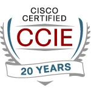

  

    <h1 style="margin-bottom: 0.2em;">Robert N. Myhre, CCIE #9837 (Active)</h1>
    
<strong>Principal Network & Cloud Networking Architect</strong>

    

      
📎 Portfolio: <a href="https://robert-n-myhre.github.io/architecture-portfolio">robert-n-myhre.github.io/architecture-portfolio</a>

      
✉️ ccie9837@gmail.com

      
🔗 <a href="https://www.linkedin.com/in/robert-n-myhre">LinkedIn</a> · <a href="https://github.com/robert-n-myhre">GitHub</a>

    

    

      Architecture isn’t just about what I design—it’s about what others can build on top of it.
    

  

  

    
  

## [Summary](https://robert-n-myhre.github.io/architecture-portfolio/)

Network and Cloud Networking Architect with over 15 years in architectural roles and more than two decades as a CCIE (active). My work focuses on data center architecture, hybrid and multi-cloud network design, secure connectivity, segmentation strategy, and repeatable infrastructure patterns across complex enterprise environments.

My current direction extends that foundation into AI-era infrastructure networking: high-performance fabric behavior, observability, automation, and lab-validated architecture patterns that help bridge emerging workloads with operationally supportable infrastructure.

---

## [Architectural Philosophy](https://robert-n-myhre.github.io/architecture-portfolio/architectural-philosophy/)

I design infrastructure with an emphasis on clarity, maintainability, operational handoff, and future adaptability. My architectural approach favors practical designs that teams can understand, validate, operate, and extend—not just diagrams that look complete on paper.

Core principles include:

- Build systems others can operate and evolve
- Validate assumptions through labs, testing, and evidence
- Prefer repeatable patterns over one-off designs
- Use automation to improve consistency without hiding complexity
- Treat observability and operational readiness as design requirements

---

## [Project Spotlights](https://robert-n-myhre.github.io/architecture-portfolio/#project-spotlights)

### 🔹 Dual Data Center Architecture (Cisco ACI)

Designed and deployed a Multi-Pod ACI fabric across two data centers with redundant 10Gbps connectivity and built-in growth potential.

### 🔹 Azure Multi-Cloud Expansion (Terraform)

Guided an AWS-heavy environment into Azure using Terraform and mirrored Hub-Spoke architecture, including firewalls and network modules.

### 🔹 Multi-Cloud Connectivity (Megaport MCR)

Architected a fully redundant cloud and on-prem connectivity model using Megaport’s MCRs and BGP, enabling scalable multi-region cloud adoption.

---

## [Reference Architectures](https://robert-n-myhre.github.io/architecture-portfolio/#reference-architectures)

I also publish sanitized reference architecture patterns that translate enterprise architecture thinking into reusable models. These are designed to be adaptable starting points, not fixed vendor-specific blueprints.

Current reference architecture themes include:

- Monitoring and classification workflows
- Human escalation and decision points
- Auditability and explainability
- AI-assisted operational patterns
- Architecture patterns that can be tuned to specific business requirements

---

## [Core Focus Areas](https://robert-n-myhre.github.io/architecture-portfolio/portfolio/selected-contributions/)

- Network & Cloud Networking Architecture
- Hybrid and Multi-Cloud Connectivity
- Data Center Architecture and Fabric Design
- Segmentation Strategy: SDA, ISE, Zoning
- Secure Cloud Connectivity: VPN, BGP, SD-WAN
- Infrastructure as Code: Terraform, Ansible
- Lab Validation and Architecture Testing
- Observability-Driven Infrastructure Design
- AI-Era Infrastructure Networking Exploration
- Cross-Team Collaboration, Mentoring, and Enablement

  Robert N. Myhre · Architecture Snapshot · <a href="https://robert-n-myhre.github.io/architecture-portfolio" style="color: #999;">robert-n-myhre.github.io/architecture-portfolio</a>

